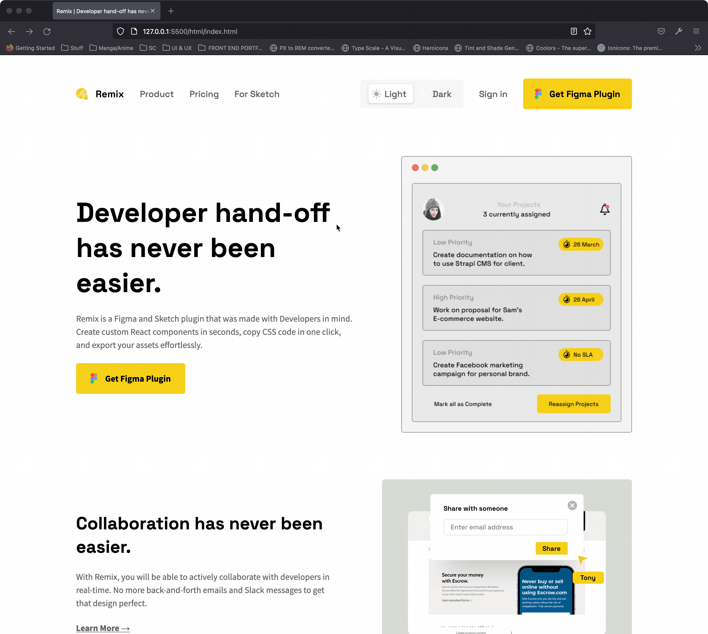
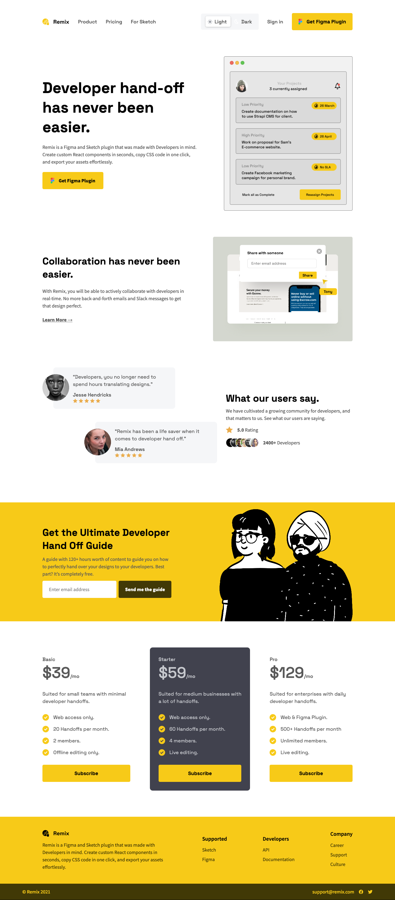
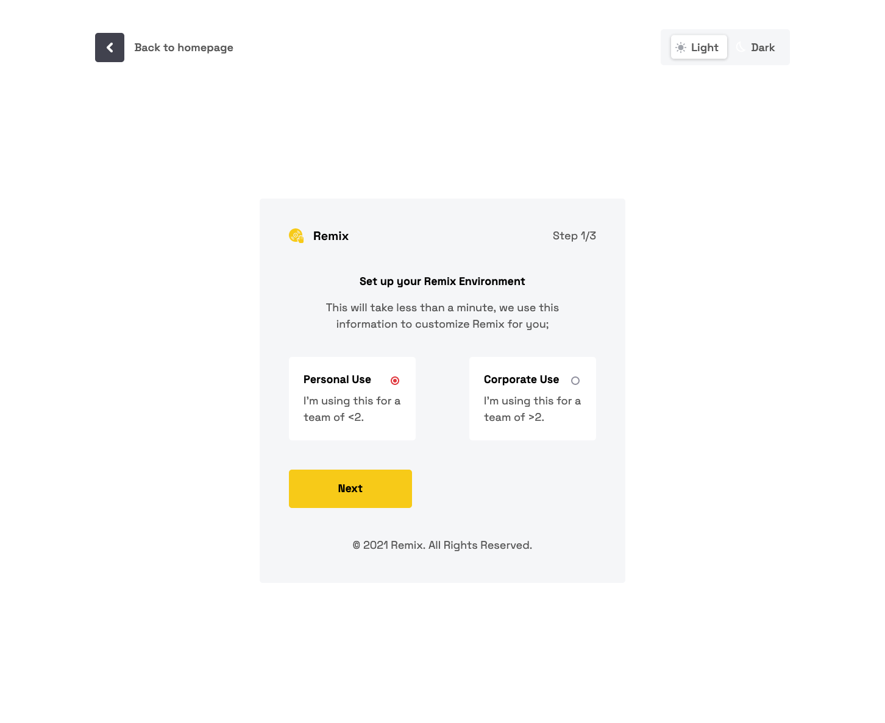
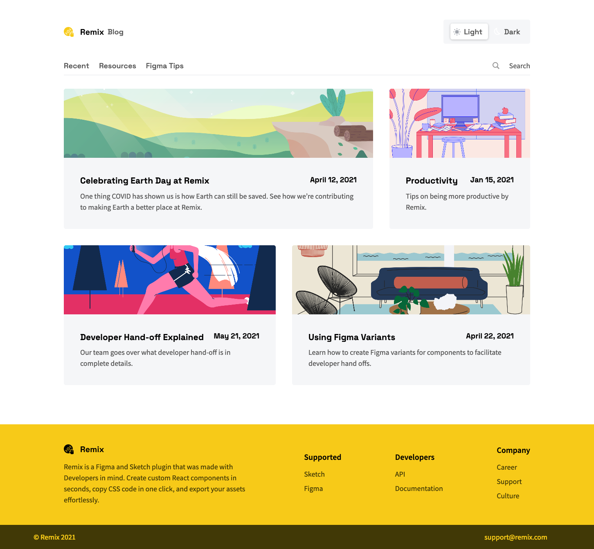

# Codewell - Fiber Landing Page 

This is a solution to the [Remix Template](https://www.codewell.cc/challenges/remix-template--609f74e13167fa10b79b7b9b). Codewell challenges help you Improve your HTML and CSS skills by practicing on real design templates.

## Table of contents

- [Overview](#overview)
  - [The challenge](#the-challenge)
  - [Demo](#demo)
  - [Screenshot](#screenshot)
  - [Links](#links)
- [My process](#my-process)
  - [Built with](#built-with)
  - [What I learned](#what-i-learned)
- [Author](#author)

## Overview

### The challenge

Users should be able to:

- View the optimal layout for the site depending on their device's screen size

### Demo

### Screenshot

### Links

- Solution URL: [Github Repo](https://github.com/KXLAA/CW-03-spense)
- Live Site URL: [Live Preview](https://github.com/KXLAA/CW-08-Remix)

## My process

### Built with

- Semantic HTML5 markup
- CSS custom properties
- Flexbox
- SCSS

### What I learned
This was a really challenging one. It took me 24 hours to complete this project. The completed site contains 3 different pages.  I had to learn on the go due to some tricky Javascript parts such as the dark mode toggle and the multi-step form. But  managed to pull it off. The site is fully responsive using SASS media query Mixins. I think the code can still be refactored further especially the Javascript code as i flaunted the DRY principle a lot especially with the dark mode toggle. I will be refactoring the code in the coming weeks.

## Author
- Website - [KXLA 🤙](https://github.com/KXLAA)

